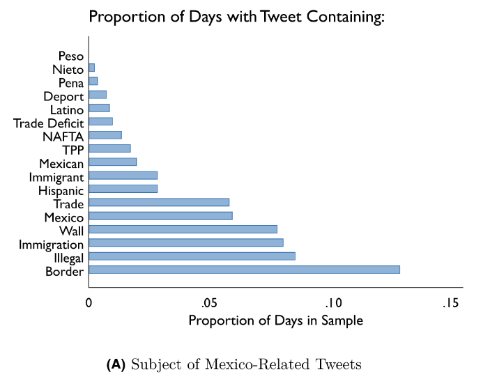
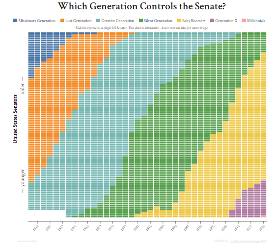
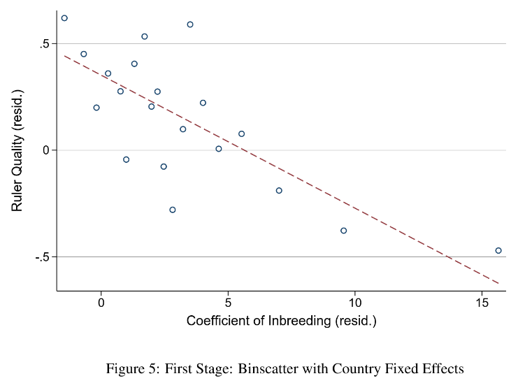
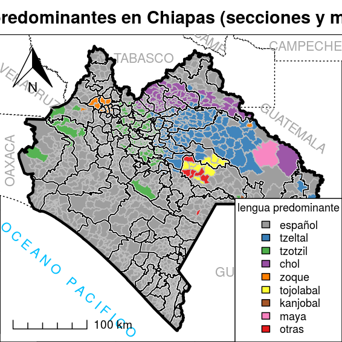
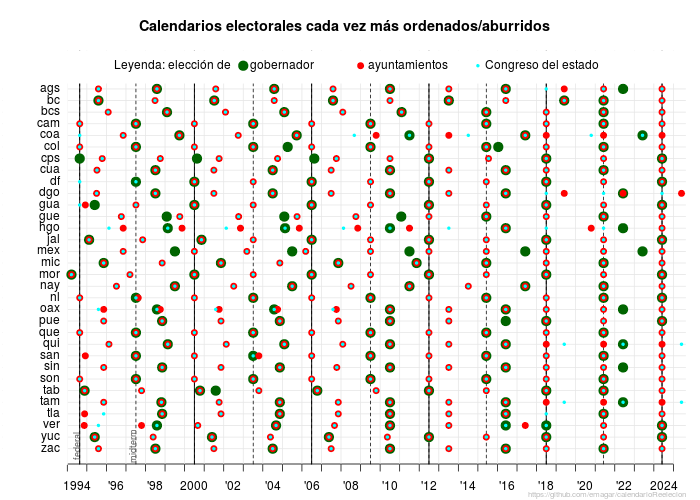

# &Iacute;ndice

1.  [Ej. 1 (18 y 20 de enero): historial de sueño (Spotify tarda en dar tu historial)](#orgf585b40)
2.  [Ej. 2 (25 de enero): tweets y mercado bursátil](#org221ef8a)
3.  [Ej. 3 (27 de enero): (des)confianza en el conteo de noviembre](#org5ab6739)
4.  [Ej. 4 (3 de febrero): *Reapportionment* 2022](#org91b92e9)
5.  [Ej. 5 (1 de marzo): cambio generacional congreso mexicano](#org90daf0a)
6.  [Mujeres en cargos de elección (8 de marzo)](#org82061b5)
7.  [Las dinastías electorales  (15 de marzo)](#org7be0c73)
8.  [Excess deaths](#orge5bc829)
9.  [Borradores de wikipedia](#org9f1bf7b)
10. [Scraping](#org773ff5e)
11. [Georreferenciación](#orgff9ba89)
12. [El calendario electoral](#orgfd7238f)
13. [Iluminación satelital](#org821c81a)
14. [Temas próximos](#orgd48e4be)

ITAM Depto. de ciencia política, primavera 2021

**Seminario de Investigación Política D**

Profesor: Eric Magar Meurs ([emagar@itam.mx](mailto:emagar@itam.mx))

Lunes y miércoles 16:00&#x2013;17:30, salón B-5

*Objetivo*: A lo largo del semestre, los alumnos desarrollarán herramientas que les permitirán documentar y escribir una historia o el guión de un documental sobre el tema de su elección. Ejemplos de temas podrían ser las dinastías políticas de un estado/región o los alcaldes asesinados por el crimen organizado. El seminario hará hincapié en tres aspectos fundamentales de este ejercicio. (1) La recopilación de evidencia preliminar relevante para la historia. (2) Cómo resumir esta evidencia con gráficos sintéticos/informativos y estadísticas descriptivas/analíticas. (3) Cómo elaborar y redactar una narrativa en torno de esta evidencia. Se espera que cada alumno entregue una versión completa de su historia al final del semestre. 

*Dinámica*: En algunas semanas dividiré el grupo en dos. Discutiremos los proyectos de una mitad los lunes, la otra los miércoles. 

*Horas de oficina*: Mientras dure el confinamiento, haga cita por mail. Cuando volvamos a las clases presenciales, serán los lunes y miércoles de 17:30 a 18:00, o con cita.  

*Evaluación*: Su calificación final se compondrá como sigue: 

-   el artículo de wikipedia (trabajo parcial) valdrá 30%
-   el artículo final valdrá 50%
-   su participación en el seminario valdrá el 20% restante.

*Notas*: (1) La página del curso es <https://github.com/emagar/sip/>. Alberga este temario, lecturas y materiales. (2) El temario sufrirá modificaciones en el transcurso del semestre para adecuarlo a los temas que irán eligiendo. Anunciaré esto con antelación en clase y se verá reflejado en este sitio. 

*Días de asueto*: 2021-02-01, 2021-03-15, 2021-03-29, 2021-03-31. 

*No habrá clase*: 2021-02-15, 2021-02-17.

*Última clase*: 2021-05-12.

---

# Ej. 1 (18 y 20 de enero): historial de sueño (Spotify tarda en dar tu historial)

-   He subido el historial de sueño obtenido con un sensor fitbit [aquí](https://github.com/emagar/sip/blob/master/data/sleep-para-alumn.csv) y [aquí](https://github.com/emagar/sip/blob/master/data/sleep-raw-para-alumn.csv). Ojo: los datos se complementan y anoche (2021-01-11) no había incluido el 2o archivo!)
-   Haga su mejor esfuerzo por hacer un croquis que cuente una historia. Si no consigue hacerlo, deberá contarnos cuál será su estrategia para abordar el problema.
-   El código en R que usaré en clase aparece en este [enlace](https://github.com/emagar/sip/blob/master/code/sleep.r).

# Ej. 2 (25 de enero): tweets y mercado bursátil

¿Los tweets de Trump movieron la bolsa? Plantee una ruta para contestar con datos e inicie su exploración.

## Enlaces útiles

-   [Cómo obtener los tweets de Trump](https://qz.com/1955036/where-to-find-trumps-tweets-now-that-hes-banned-from-twitter/)
-   [Acervo de tweets de Trump](https://www.thetrumparchive.com/)
-   [Estrada+Poire 2007](https://github.com/emagar/sip/blob/master/lit/estrada-poire-taught-to-protest-2007jod.pdf)
-   [Paper Benton-Philips](https://github.com/emagar/sip/blob/master/lit/benton-philips-trump-tweets2020ajps.pdf)

## Código

-   Hay código `Python` para automatizar la búsqueda de valores en NYSE [aquí](https://github.com/emagar/sip/blob/master/code/get-days-quotes.py).

[Arriba](#org3574273)

# Ej. 3 (27 de enero): (des)confianza en el conteo de noviembre

-   Planee el argumento de una historia en torno de las siguientes gráficas.

-   [[<https://github.com/emagar/sip/blob/master/lit/estrada-poire-taught-to-protest-2007jod.pdf>][Estrada+Poire 2007]

[Arriba](#org3574273)

# Ej. 4 (3 de febrero): *Reapportionment* 2022

-   [Szpiro ch 9 Founding Fathers](https://github.com/emagar/ep3/blob/master/lecturas/szpiro2010-Numbers-rule-ch09-founding-fathers.pdf)
-   [Szpiro ch 10 Ivy Leaguers](https://github.com/emagar/ep3/blob/master/lecturas/szpiro2010-Numbers-rule-ch10-ivy-leaguers.pdf)
-   [Población por estado](./data/ptot-edo-2010-2020.csv)

[Arriba](#org3574273)

# Ej. 5 (1 de marzo): cambio generacional congreso mexicano

-   Requiere poca info de mucha gente: año de nacimiento de diputados y/o senadores a lo largo de los años, quizás cada década?
-   ¿cómo resumir esta info en un buen diagrama?
-   P.ej.:

 
<https://www.wcd.fyi/features/senate-generations/>

[Arriba](#org3574273)

# Mujeres en cargos de elección (8 de marzo)

-   Posible terminar de codificar sexos femenino y masculino [aquí](https://github.com/emagar/elecRetrns/blob/master/data/dfdf2000-present-incumbents.csv), [aquí](https://github.com/emagar/dipMex/tree/master/data/diputados) y [aquí](https://github.com/emagar/elecRetrns/blob/master/data/aymu1989-present.incumbents.csv).
-   Ojo con los nombres unisex como Guadalupe, Cruz o Trinidad.
-   Para después buscar variaciones en espacio y tiempo.
-   [Tesis Piscopo 2010](https://github.com/emagar/sip/blob/master/lit/piscopo-dissertation-pref-ch2-ch3-2010.pdf)

[Arriba](#org3574273)

## Minorías, gerontocracias

-   [Weiss, Chagai M. Diversity in Israeli Healthcare Institutions Reduces Prejudice towards Arabs.](https://chagaimweiss.com/publications)
-   McClean, [Silver democracy](https://www.charlesmcclean.com/book-project).

# Las dinastías electorales  (15 de marzo)

-   Libro de [Dan Smith](https://github.com/emagar/sip/blob/master/lit/smithDanDynasticBookManuscript-1-24-2017.pdf). Lean bien caps. 1, 3 y 5. Caps 2 y 4 sólo echen un ojo rápido a los gráficos, permiten ven el argumento.
-   *The Economist*,  [Leader-driven theory of history](https://github.com/emagar/sip/blob/master/lit/economist-inbreeding2021.pdf) 20 feb 2021.

-   Ottinger-Voigtländer 2021 [Monarchs and state performance](https://github.com/emagar/sip/blob/master/lit/ottinger-voigtlander-Inbred-leaders2021.pdf).
-   Proyecto: aplicarlo a un estado desde el porfiriato.
-   Falta: caso UK en The Son also Rises.
-   Otro pendiente: Patronimios y matronimios en el poder judicial, Julio Ríos

[Arriba](#org3574273)

# Excess deaths

-   [Florence Nightingale plots](https://www.cebm.net/covid-19/covid-19-florence-nightingales-daigrams-for-deaths/).

-   [Sobre Florence Nightingale](https://thisisstatistics.org/florence-nightingale-the-lady-with-the-data/).
-   [Economist tracker](https://www.economist.com/graphic-detail/coronavirus-excess-deaths-tracker).
-   [Datos del *Financial Times*](https://github.com/emagar/coronavirus-excess-mortality-data).
-   [Animación de Baptiste Coulmont](https://twitter.com/i/status/1360545213144592385)

[Arriba](#org3574273)

# Borradores de wikipedia

🔶 *Ojo*: cuando den retroalimentación, debería ayudar que adopten la perspectiva de quien consulta wikipedia y preguntarse si el texto les contesta lo que quisieran saber sobre el tema en cuentión. ¿Hay pendientes? ¿Puede aclararse el texto? Elaboren cómo mejorar el artículo en la sección de Discusión. 🔶

-   Ana [Aborto en México](https://es.wikipedia.org/wiki/Aborto_en_México) 
    -   He rescatado tus ediciones, moví la subsección de códigos penales a la sección comparativa de estados. Añade un cuadro que resuma las características, puse el ejemplo de código en la sección de 'Discusión'.
    -   El editor lo volvió a quitar, esto es lo que tienes que atender: <https://es.wikipedia.org/wiki/Usuario_discusi%C3%B3n:Eric.magar#Aborto_en_M%C3%A9xico>
    -   Hay que pulir el párrafo de introducción del artículo, empecé a hacerlo pero aún falta.
    -   Retroalimentas a **Daniela A.**
-   Bárbara [CBT](https://es.wikipedia.org/wiki/Terapias_cognitivo-conductuales#Críticas)
    -   Hice corrección de estilo en el wiki.
    -   Falta quitar muchos anglicismos. Por la extensión del texto, quizás convenga que pulas sólo una parte y dejes un comentario en 'discusión' para que otros te ayuden con el resto.
    -   Retroalimentas a **Miguel**
-   Carolina y Jorge [Desigualdades](https://es.wikipedia.org/wiki/Desigualdades_en_México) 
    -   Dejé algunas anotaciones en la sección discusión.
    -   Carolina retroalimentas a **Mashe**
    -   Jorge retroalimentas a **Marina**
-   Juan Pablo [Dinastías Veracruz](https://es.wikipedia.org/wiki/Dinastías_de_Veracruz_(México)) y [dinastías políticas](https://es.wikipedia.org/wiki/Dinastía) 
    -   Alternativa a 'candidato heredado' es 'hereditario', ¿cuál traduce mejor *legacy candidate*?
    -   Sugiero convertir el texto de 'Dinastías Veracruz' (que el editor borró, increíble) en una sección nueva al final de 'Dinastías políticas'.
    -   14abr: el enlace a las dinastías de Veracruz está roto, y tampoco veo que hayas mudado el contenido al artículod e dinastías políticas, dónde quedó?
    -   Retroalimentas a **Ana Patricia**
-   Manuel Ch. [Ley de cuotas](https://es.wikipedia.org/wiki/Ley_de_cuotas) 
    -   Retro Eric: dejé observaciones en la 'discusión'.
    -   Retroalimentas a **Carolina y Jorge**
-   Manuel M. [JCyA](https://en.wikipedia.org/wiki/Draft:Juntas_de_Conciliación_y_Arbitraje)
    -   Hice corrección de estilo en el wiki.
    -   Tendré que ver de nuevo cuando haya progresado el borrador, que estaba en ciernes.
    -   Retroalimentas a **Vidal**
-   Mashe [Deserción escolar](https://es.wikipedia.org/wiki/Deserción_escolar)
    -   Dejé comentarios en 'Discusión', corregí estilo.
    -   Retroalimentas a **Carolina y Jorge**
-   Marina [Guerra terror](https://es.wikipedia.org/wiki/Guerra_contra_el_terrorismo) 
    -   Dejé correcciones de estilo en el wiki.
    -   Retroalimentas a **Bárbara**
-   Miguel [Impeachment](https://es.wikipedia.org/wiki/Proceso_de_destitución#Honduras)
    -   Hice corrección de estilo en el wiki.
    -   Retroalimentas a **Santiago**
-   Mirna [Exceso de mortalidad](https://es.wikipedia.org/wiki/Exceso_de_mortalidad)
    -   He dejado anotaciones en 'discusión'.
    -   Retroalimentas a **Juan Pablo**
-   Santiago [Area metro GDL](https://en.wikipedia.org/wiki/Guadalajara_Metropolitan_Area) 
    -   Me parece que el editor quitó tu foto porque no la subiste a wikimedia commons.
    -   Hay otra página con mismo nombre sin mayúsculas. Es el origen de que desaparezca tu texto. Creo. 🔵 Sugiero re-bautizar tu nota 'Greater Guadalajara' y empezaría algo así: Greater Guadalajara, known in Mexico as the Guadalajara Metropolitan Area (GMA), is the geographic area&#x2026; 🔵 Esto lo haces con el botón 'move' (mándame el nuevo enlace cuando lo hagas).
    -   Supongo que puedes ponerle etiquetas a tu nota. Pon 'Area Metropolitana' y 'Guadalajara'.
    -   Retroalimentas a **Manuel M.**
-   Vidal [Agricultura michoacana](https://en.wikipedia.org/wiki/Draft:Michoacán_agriculture) 
    -   Corregí estilo y dejé comentario en talk
    -   Retroalimentas a **Mirna**

## No han entregado (al 6 de abril)

-   Ana Patricia
    -   Retroalimentas a **Ana**
-   Daniela A.
    -   Retroalimentas a
-   Daniela P.
    -   Retroalimentas a
-   Gabriela
    -   Retroalimentas a
-   Fermín
    -   Retroalimentas a
-   Pamela [Servicio salud penitenciario](https://es.wikipedia.org/wiki/Usuario_discusión:Pamelaquirarte#Servicios_de_Salud_en_Centros_Penitenciarios_Mexicanos) &#x2014; pendiente

[Arriba](#org3574273)

# Scraping

## Sitios estáticos vs sitios dinámicos

## Proposiciones con puntos de acuerdo en la Cámara de Diputados.

-   Ejemplo de sitio estático
-   Cámara detuvo sistematización [hace un año !!](http://gaceta.diputados.gob.mx/gp_propos.html)
-   Ayer arrancaron las campañas ¿los ocupantes que buscaron renominarse se distinguen en cantidad/calidad de proposiciones?
-   Extraigan proposiciones (si no lo logran, describan lo que intentaron y dónde se atoraron).

## Aproximación cardinal a la CPEUM (sitio del IIJ).

## Regular expressions

-   [An introduction to regular expressions](https://www.oreilly.com/content/an-introduction-to-regular-expressions/#:~:text=A regular expression matches a,, substring, or split text.).
-   [Jackman Data from the web into R](https://github.com/emagar/sip/blob/master/lit/tpm_v14_n2.pdf)
-   [Expresiones regulares básicas](http://marvin.cs.uidaho.edu/Handouts/regex.html).
-   [Prueba tus expresiones regulares en línea](https://regex101.com/).
-   [Discursos en la cámara de diputados](https://github.com/emagar/sip/blob/master/lit/magar-legdeb04.pdf).

[Arriba](#org3574273)

## Sitio del Congreso chileno

-   Ejemplo de sitio dinámico
-   Javascript, Python y Selenium

## El infierno de los *character encodings*

-   Manual de Python solía tener una historia&#x2026;
-   [Absolute minimum about unicode and character sets](https://www.joelonsoftware.com/2003/10/08/the-absolute-minimum-every-software-developer-absolutely-positively-must-know-about-unicode-and-character-sets-no-excuses/)

# Georreferenciación

-   Dibujar los municipios indígenas de Chiapas \(\rightarrow\) [código](https://github.com/emagar/sip/blob/master/code/mapaDisCps.r) (está en chino usarlo porque los datos están en otros lados, pero permite ver cómo se procede)
-   Mapa de alfas
-   Mapa de AMLO 2018

# El calendario electoral

 

-   [Datos aquí](https://github.com/emagar/calendarioReelecion)
-   Variable explicativa o variable dependiente

# Iluminación satelital

-   [Datos del NOAA 1993-2013](https://ngdc.noaa.gov/eog/dmsp/downloadV4composites.html)
-   [Armonización de series 1992-2013 y 2012-2018](https://www.nature.com/articles/s41597-020-0510-y)

# Temas próximos

## Git y github

## New Yorker football scouts como comparativo del tino de nombramientos.

## Ejercicio: coaliciones que se vislumbran en los estados; alcaldes que aspiran a reelegirse; diputados que idem

## Ejercicio: votaciones nominales en la cámara de diputados

## Ejercicio: votos y escaños

## Usar los datos de seats and votes: representación gráfica que permita contar una historia (Rehacer mi seats-votes plot para OAS)

-   Darles losdatos, que investiguen qué se ha escrito.
-   Que investgen por qué importa &#x2014; base para la historia
-   Discutir ss intentos de gráficos.
-   Rehacerla n vivo.
-   Sacar patrnes para contar la historia

## No sé qué de esto vendrá al caso

## Caricatura política

## Ejercicio inicial: Historia de música que escucharon en 2020

## Alma Guillermoprieto, basureros como un ejemplo con entrevistas

## Efficient secret.

## CSES.

## Llenar biografías de alcaldes y municipios en wikipedia

## Dificultad de colaboración epidemiólogos/economistas Ver free exchange 14nov

## Quizás <https://economia.nexos.com.mx/?p=3456> <- aplicarlo a indígenas, a ex-beneficiarios de progresa/seguro popular

## Encuesta ITAM: cambio de hábitos covid, tipo esto <https://www.economist.com/the-world-ahead/2020/11/17/what-does-it-take-to-make-a-new-habit-stick>

## Herramientas

