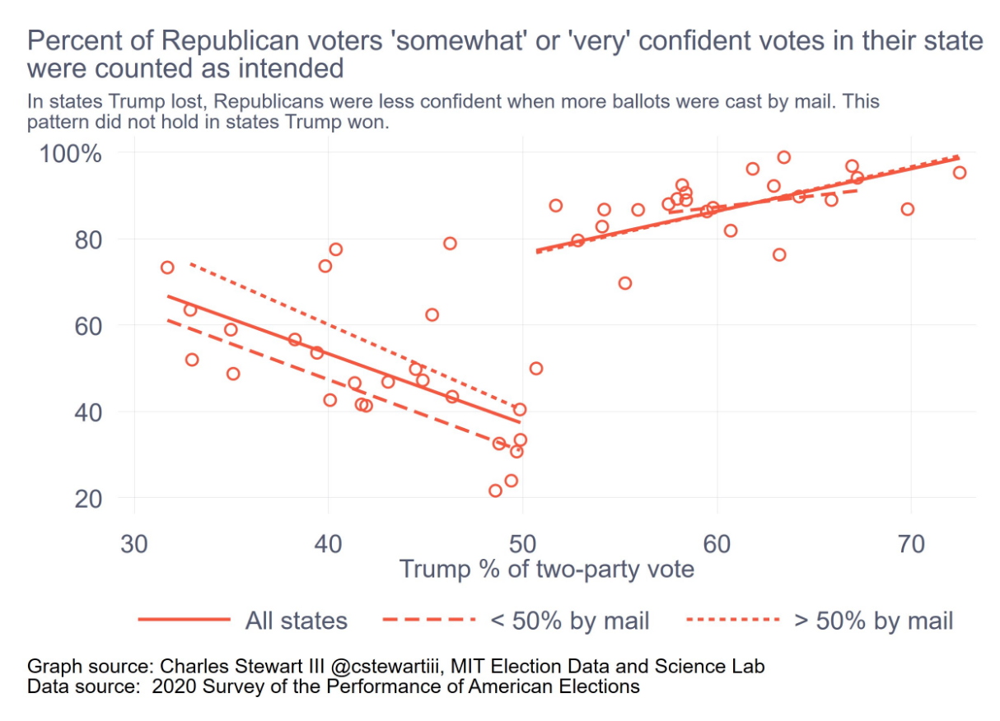
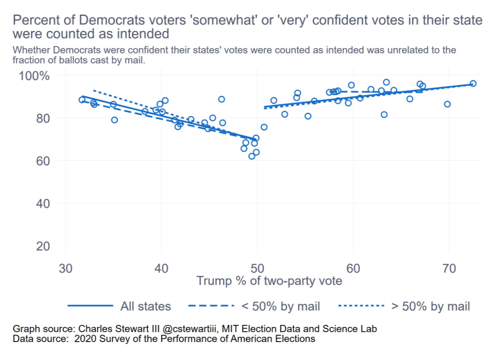

ITAM Depto. de ciencia política, primavera 2021

**Seminario de Investigación Política D**

Profesor: Eric Magar Meurs ([emagar@itam.mx](mailto:emagar@itam.mx))

Lunes y miércoles 16:00&#x2013;17:30, salón B-5

*Objetivo*: A lo largo del semestre, los alumnos desarrollarán herramientas que les permitirán documentar y escribir una historia o el guión de un documental sobre el tema de su elección. Ejemplos de temas podrían ser las dinastías políticas de un estado/región o los alcaldes asesinados por el crimen organizado. El seminario hará hincapié en tres aspectos fundamentales de este ejercicio. (1) La recopilación de evidencia preliminar relevante para la historia. (2) Cómo resumir esta evidencia con gráficos sintéticos/informativos y estadísticas descriptivas/analíticas. (3) Cómo elaborar y redactar una narrativa en torno de esta evidencia. Se espera que cada alumno entregue una versión completa de su historia al final del semestre. 

*Dinámica*: En algunas semanas dividiré el grupo en dos. Discutiremos los proyectos de una mitad los lunes, la otra los miércoles. 

*Horas de oficina*: Mientras dure el confinamiento, haga cita por mail. Cuando volvamos a las clases presenciales, serán los lunes y miércoles de 17:30 a 18:00, o con cita.  

*Evaluación*: Evaluaré el trabajo que entregue y la participación del alumnos cuando Habrá un examen parcial y otro final. 

*Notas*: (1) La página del curso es <https://github.com/emagar/sip/>. Alberga este temario, lecturas y materiales. (2) El temario sufrirá modificaciones en el transcurso del semestre para adecuarlo a los temas que irán eligiendo. Anunciaré esto con antelación en clase y se verá reflejado en este sitio. 

*Días de asueto*: 2021-02-01, 2021-03-15, 2021-03-29, 2021-03-31. 

*No habrá clase*: 2021-02-15, 2021-02-17.

*Última clase*: 2021-05-12.

---

Lecturas, ideas, temas

# Ejercicio 1 (18 y 20 de enero): historial de sueño (Spotify tarda en dar tu historial)

-   He subido el historial de sueño obtenido con un sensor fitbit [aquí](https://github.com/emagar/sip/blob/master/data/sleep-para-alumn.csv) y [aquí](https://github.com/emagar/sip/blob/master/data/sleep-raw-para-alumn.csv). Ojo: los datos se complementan y anoche (2021-01-11) no había incluido el 2o archivo!)
-   Haga su mejor esfuerzo por hacer un croquis que cuente una historia. Si no consigue hacerlo, deberá contarnos cuál será su estrategia para abordar el problema.
-   El código en R que usaré en clase aparece en este [enlace](https://github.com/emagar/sip/blob/master/code/sleep.r).

# Ejercicio 2 (25 de enero): los tweets de Trump y la bolsa

¿Los tweets de Trump movieron la bolsa? Plantee una ruta para contestar con datos e inicie su exploración.

## Enlaces útiles

-   [Cómo obtener los tweets de Trump](https://qz.com/1955036/where-to-find-trumps-tweets-now-that-hes-banned-from-twitter/)
-   [Acervo de tweets de Trump](https://www.thetrumparchive.com/)
-   [Paper Benton-Philips](https://www.dropbox.com/s/avhokdg9enr5p8s/BentonPhilips2020_AJPS.pdf?dl=0)

# Ejercicio 3 (27 de enero): (des)confianza en el conteo de EE.UU.

-   Planee el argumento de una historia en torno de las siguientes gráficas.

# Ejercicio 4 (1 de febrero): *Reapportionment* 2022

# Ejercicio: votaciones nominales en la cámara de diputados

# Ejercicio: votos y escaños

## Usar los atos de seats and votes para hacer una representación gráfica que permita contar una historia (Rehacer mi seats-votes plot para OAS)

-   Darles losdatos, que investiguen qué se ha escrito.
-   Que investgen por qué importa &#x2014; base para la historia
-   Discutir ss intentos de gráficos.
-   Rehacerla n vivo.
-   Sacar patrnes para contar la historia

# Ejercicio: proposiciones con puntos de acuerdo en la Cámara de Diputados

## Ejerciciorudimentario de scraping.

## Texto de craping de CA

## Extraer poposiciones (si no lo logran, deben poder describir lo que intentaron y dónde se atoraron).

# Ejercicio: aproximación cardinal a la CPEUM

## Scraping del sitio del IIJ

## Variables dependientes?

# Ejercicio: Regular expressions

# Ejercicio de scraping en Python: Javascript y Selenium

## Sitios estáticos vs sitios dinámicos

## Sitio del Congreso chileno

## Sitio del Congreso brasileño

# No sé qué de esto vendrá al caso

## Caricatura política

## Ejercicio inicial: Historia de música que escucharon en 2020

## Replicar el diagrama radial de @coulmont

## Alma Gullermoprieto, basureros como un ejemplo con entrevistas

## New Yorker football scouts como comparativo del tino de nombramientos.

## Efficient secret.

## CSES.

## Dinastías políticas, Smith. Que lo apliquen a un estado desde el porfiriato.

## Edades de los diputados a través de las legislaturas

## Llenar biografías de alcaldes y municipios en wikipedia

## Escess deaths (tengo  plot the ecpnomist en email)

## Dificultad de colaboración epidemiólogos/economistas Ver free exchange 14nov

## Quizás <https://economia.nexos.com.mx/?p=3456> <- aplicarlo a indígenas, a ex-beneficiarios de progresa/seguro popular

## Patronimios y matronimios en el poder judicial, Julio Ríos

## Encuesta ITAM: cambio de hábitos covid, tipo esto <https://www.economist.com/the-world-ahead/2020/11/17/what-does-it-take-to-make-a-new-habit-stick>

# Herramientas

## Git y github

## El infierno de los character encodings

